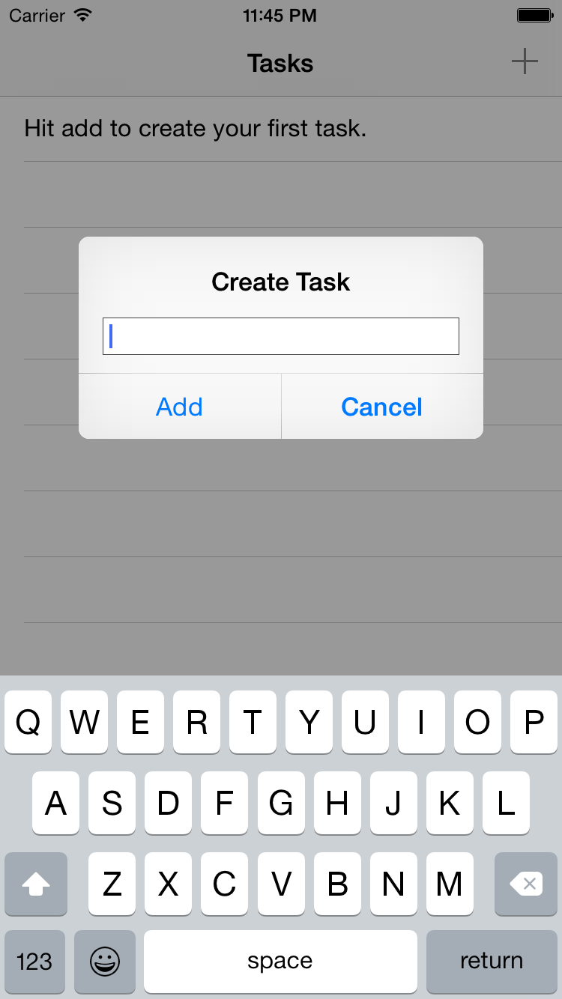

QueryKit Todo Example
=====================

This application is a really simple example using
[QueryKit](https://github.com/QueryKit/QueryKit) and
[querykit-cli]((https://github.com/QueryKit/QueryKit).

To run the application, follow these simple steps:

1. Open `Todo.xcworkspace`
2. Hit "Build & Run"

## License

QueryKit and it's examples are released under the BSD license. See [LICENSE](LICENSE).

